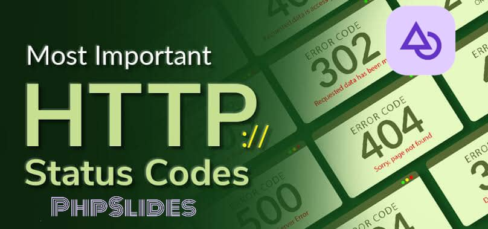

# PhpSlides HTTP Status

<div align="center">
   
</div>

## Installation

After creating your PhpSlides project, navigate to the project directory and install PhpSlides-Status package using this command below:

```bash
composer require dconco/phpslides-status
```

Or download the zip file directly from the released version, ectract the file and add it to a folder 📂 in your PhpSlides project.

[Download phpslides-status zip](https://github.com/dconco/phpslides-status/releases/tag/v0.0.1)

## Documentation

### Using Status() class function

Create a Status instance for API response. Which is used in PhpSlides API Controller Class

```php
<?php

namespace PhpSlides\Controller\Api;

use PhpSlides\Controller\Controller;
use PhpSlides\Status;

final class UserController extends Controller
{
   public function __invoke() {
      $status = new Status();
   }
}

?>
```

You can pass a string value to the `Status()` function parameter which is by default `Response::JSON` using the Response namespace `PhpSlides\Http\Response`

In returning value in JSON format. The parameter includes this enum value type:

```php
use PhpSlides\Http\Response;

Response::JSON;
Response::HTML;
Response::CSV;
Response::XML;

new Status(Response::JSON);
```

If the parameters contain any value apart from the `enum ResponseType value`
it'll return default value an array form, which isn't recommended.

### Some Functions & Methods

#### success() method

Returning a default success message, using the `success()` method.

```php
<?php

use PhpSlides\Status;
use PhpSlides\Http\Response;

final class UserController extends Controller {
   public function __invoke() {
      $status = new Status(Response::JSON);
      return $status->success();
   }
}

?>
```

The `success()` method takes 2 parameters, `$data` to render and `$status` which is the status code.

The first parameter can be either Array or String and the second parameter is an Integer from `StatusCode` static class.
It returns `Response::<type>` which is passed as a parameter in the `Status()` function.

```php
use PhpSlides\StatusCode;

$user = [
    "name": "John Doe",
    "email": "john@doe.com"
];
return $status->success($user, StatusCode::OK);
```

#### error() method

Returning an error Api message using the `error()` method
It also takes 2 parameters, the first is either an Array or String and the second which is interger for setting `http_response_code`,
it has default value of `StatusCode::INTERNAL_SERVER_ERROR`

It also returns `Response::<type>`

```php

return $status->error('User not Found', StatusCode::NOT_FOUND);
```

#### Full code for success() & error() methods

If no parameter is specified in the `Status()`,
by default it's returning `Response::JSON` for returning response in JSON format

```php
<?php

namespace PhpSlides\Controller\Api;

use PhpSlides\Controller\Controller;
use PhpSlides\Http\Response;
use PhpSlides\StatusCode;
use PhpSlides\Status;

final class UserController extends Controller
{
   public function __invoke(int $user_id) {
      $status = new Status();

      if ($user_id === 1) {
         $user = [
             'name': 'John Doe',
             'email': 'john@doe.com',
             'user_id': $user_id
         ];

         $response = $status->success($user); // by default the second parameter is `StatusCode::OK`
      } else {
         // not found message
         $response = $status->error("User user_id=$user_id is not found", StatusCode::NOT_FOUND);
      }

      return $response; // return message as a JSON format `Response::JSON`
   }
}

?>
```

## Namespace and Status Interface

### namespace

`\PhpSlides\Status()`

`\PhpSlides\StatusCode`

`\PhpSlides\StatusText`

`\PhpSlides\Http\Response`

`\PhpSlides\Enums\ResponseType`

`\PhpSlides\Interface\StatusInterface`

`\PhpSlides\Interface\ResponseInterface`

`\PhpSlides\Exception\ApiException()`

`\PhpSlides\Exception\ExceptionInterface`

### Status() Interface Methods

`__construct(string $response = Response::JSON)`

`public function getStatus (): int;`

`public function getStatusText (): string;`

`public function getMessage (): mixed;`

`public function get (): string|array;`

`public function getJson (): string;`

`public function set (mixed $data, int $status = StatusCode::NO_CONTENT, string $statusText = StatusText::NO_CONTENT ): void;`

`public function setStatus (int $status): void;`

`public function setStatusText (string $statusText): void;`

`public function setMessage (mixed $message): void;`

`public function error (array|string $data, int $status = StatusCode::INTERNAL_SERVER_ERROR): string|array;`

`public function success (array|string $data, int $status = StatusCode::OK): string|array;`

### Response{} Interface Method

`const JSON = ResponseType::JSON;`

`const HTML = ResponseType::HTML;`

`const CSV = ResponseType::CSV;`

`const XML = ResponseType::XML;`

`public static function json(array $data = [], int $status = StatusCode::OK): string;`

`public static function html(array $data = [], int $status = StatusCode::OK): string;`

`public static function csv(array $data = [], int $status = StatusCode::OK): string;`

`public static function xml(array $data = [], int $status = StatusCode::OK): string;`

`public static function array(array $data = [], int $status = StatusCode::UNSUPPORTED_MEDIA_TYPE): array;`

### enum ResponseType{} Interface

`const JSON = 'JSON';`

`const HTML = 'HTML';`

`const CSV = 'CSV';`

`const XML = 'XML';`
